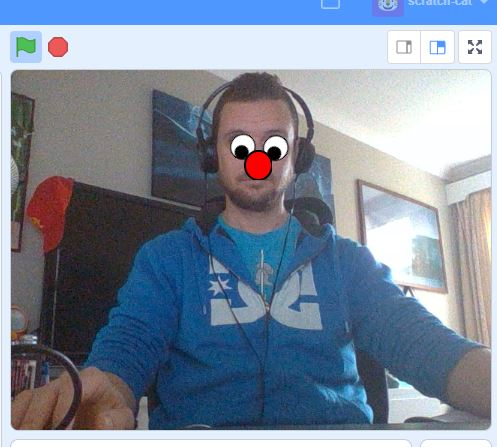

## Introduction

Today, you’re going to be using a different version of Scratch (what programmers call a ‘fork’) that is pre-made with special Extensions created by IBM. Today, you're going to use machine learning to do facial recognition! 

### What you will make

--- no-print ---
In this activity, you will use a cloud-based machine learning engine called Watson (with Scratch!) to create a project that will recognise your face in the webcam and place some funny sprites over it to make a mask that follows you!

--- /no-print ---

--- collapse ---
---
title: What you will need
---
### Hardware

+ A computer or tablet capable of running Scratch 3
+ A webcam (your tablet will have one of these already)

### Software

+ This project can only be completed in a web browser using a special version of [Scratch 3](https://machinelearningforkids.co.uk/scratch3/)

--- /collapse ---

--- collapse ---
---
title: What you will learn
---

+ How to use the Scratch extensions `Video Sensing`{:class="block3extensions"} and `Facial Recognition`{:class="block3extensions"}
+ How to interact with a pre-trained machine learning model

--- /collapse ---

--- collapse ---
---
title: Additional information for educators
---

You can download the completed project [here](http://rpf.io/p/en/Funny-Face-Follower-get){:target="_blank"}.

If you need to print this project, please use the [printer-friendly version](https://projects.raspberrypi.org/en/projects/funny-face-follower/print){:target="_blank"}.

--- /collapse ---
