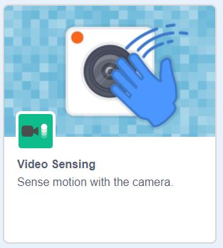
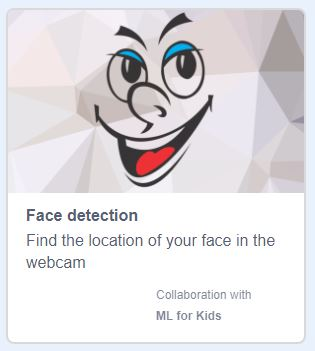

## Facial recognition with Scratch

For this activity, we’re going to use a special version of Scratch created for just this reason! You can open this special fork of Scratch any time by following [this link](https://machinelearningforkids.co.uk/scratch3/){:target="_blank"} to make your own machine learning projects.


Unfortunately, because this version of Scratch is a bit different to the normal one - if you want to be able to save your work, you’ll need to download your project to your computer and re-open it in the special version of Scratch when you want to use it again.

[[[generic-scratch-saving]]]

--- task ---

If working **online**, open the [starter project](https://machinelearningforkids.co.uk/scratch3/){:target="_blank"} in Scratch.
 
As this project requires connection to the cloud based machine learning engine, offline work is not possible.

You should see the normal looking Scratch environment, with a couple of small differences. You'll notice there is no 'Remix' button and you cannot log in as usual. 

--- /task ---
Once you’ve followed the link above, you should be able to see a brand new, empty Scratch project, just like you're used to - the cool part comes when we add some Extensions that are only included in this special fork of Scratch.
--- task ---
The two extensions we want to enable are **Video Sensing** and **Facial Recognition** - add them both now.

 

--- collapse ---

--- 
title: Adding extensions in Scratch
---
--- /collapse ---

--- /task ---

Now that we have added the extensions we need to Scratch, you should see two new menus on the left of your screen. You may have used Video Sensing before, but the Facial Recognition blocks may be new to you. 

These new blocks have been created to access an already existing Machine Learning model that exists on the cloud and has been trained to recognise human faces. We’re simply using these blocks to tell Scratch to check with the online model to see where the face appears on your stage.

Let’s see if they work!

--- task ---
Begin by adding a `When Green Flag Clicked`{:class="block3events"} to start our project.
```blocks3
when green flag clicked
```
--- /task ---

--- task ---
Next, we need to use our `video sensing`{:class="block3extensions"} blocks to make sure to `turn the camera on`{:class="block3extensions"} and totally opaque when the project starts. Add a `set transparency to 0`{:class="block3extensions"}.
```blocks3
when gf clicked
+turn video [on v]
+set video transparency to (0)

```
--- /task ---

--- task ---
Click the **Green flag** to test your work and see the camera come online.  
Give your browser permission to use your camera if you are asked.
--- /task ---

Now, we're going to change the costume of our cat sprite to something more like a face.

--- task ---
Stop the project and click on the **Costumes tab** for your cat sprite. 
**Add a new costume** to use as your mask and delete the old ones of the cat by clicking the bin icon on the costume. 

Here I've used the 'heart face' costume, but you can use anything you like.


---collapse ---
---
title: Adding costumes in Scratch
---
--- /collapse ---

--- /task ---

Now, we're going to add the code that will make the mask detect and follow your face!

--- task ---
At the bottom of your script, add a `forever`{:class="block3control"} block from the control list. 
```blocks3
when gf clicked
turn video [on v]
set video transparency to (0)
+forever

```
--- /task ---

--- task ---
Next, add a `go to x and y`{:class="block3motion"} block inside your forever loop.
```blocks3
when gf clicked
turn video [on v]
set video transparency to (0)
forever
+    go to x:()y:()
```
--- /task ---

--- task ---
Open the `Facial Recognition`{:class="block3extensions"} menu on the left and drag across the small round `x coord of nose`{:class="block3extensions"} and `y coord of nose`{:class="block3extensions"} blocks and pop them into their corresponding spots (making sure you match x with x and y with y!)
``` blocks3
when gf clicked
turn video [on v]
set video transparency to (0)
forever
+    go to x:(x coord of (nose v)::#0fbd8c)y:(y coord of (nose v)::#0fbd8c)
```
--- /task ---

--- task ---
Click the **Green flag** and see if your project works.

Your mask should now follow your face wherever you go!
--- /task ---

In the next step, we'll create a silly mask made up of different sprites that will independently cover your nose and eyes!

--- save ---
