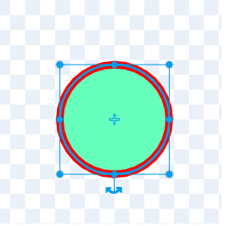
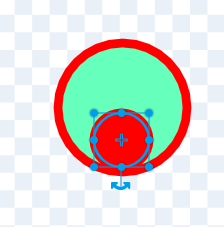

## Make a mask

In this step, you will make individual sprites that will anchor to your eyes and nose to make a funny cartoon face that follows your face around the screen!

--- task ---
Go into the **Costumes** tab for your current sprite. Go to the menu in the bottom left-hand corner and click on **Paint** (the paintbrush icon that appears) to create a new costume in the Paint editor. Select a **Fill** colour and use the **Circle** tool to create a simple circle shape that will be the nose of your mask.

[[[generic-scratch-vector-mode]]]

--- /task ---

--- task ---
Next, create a new sprite. Go to the menu in the bottom right-hand corner of the Sprite list and click on **Paint** (the paintbrush icon that appears). This will create a new sprite and open the Paint editor.

Make this sprite look like an eye: draw one circle inside another and make the circles different colours.
 
--- /task ---

--- task ---
Go back to the **Nose** sprite and copy the script in the Code area onto your new **Eye** sprite. To do this, drag the script across to where your **Eye** sprite is shown in the Sprite list below the Stage. When your mouse cursor is over the **Eye** sprite, you should see the sprite wiggle to notify you that you can let go. Let go of your mouse button and it will copy the script across to the **Eye** sprite.
``` blocks3
when gf clicked
turn video [on v]
set video transparency to (0)
forever
    go to x:(x coord of (nose v)::#0fbd8c)y:(y coord of (nose v)::#0fbd8c)
```
--- /task ---

--- task ---
Click on the **Eye** sprite now and go into its **Code** tab. Remove the `turn video on`{:class="block3extensions"} and `set transparency to 0`{:class="block3extensions"} blocks from the script. 

In the two `coord of nose`{:class="block3extensions"} blocks, click on the drop-down menus and select `right eye`{:class="block3extensions"}.
``` blocks3
when gf clicked
forever
+    go to x:(x coord of (right eye v)::#0fbd8c)y:(y coord of (right eye v)::#0fbd8c)
```
--- /task ---

--- task ---
Duplicate your new **Eye** sprite. To do this, right-click on it in the Sprite list below the Stage and choose **duplicate**.
--- /task ---

--- task ---
Click on your new **Eye** sprite and go into its **Code** tab. In the two `coord of right eye`{:class="block3extensions"} blocks, click on the drop-down menus and select `left eye`{:class="block3extensions"}.
``` blocks3
when gf clicked
forever
+    go to x:(x coord of (left eye v)::#0fbd8c)y:(y coord of (left eye v)::#0fbd8c)
```
--- /task ---

--- task ---
Click on the green flag to see your new face mask come to life and follow you around the screen!
--- /task ---

--- save ---
